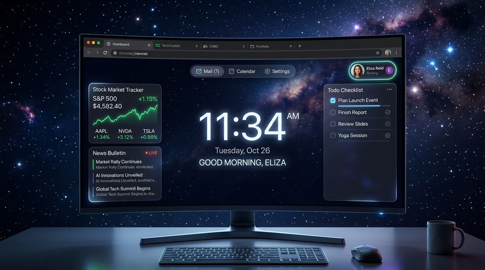
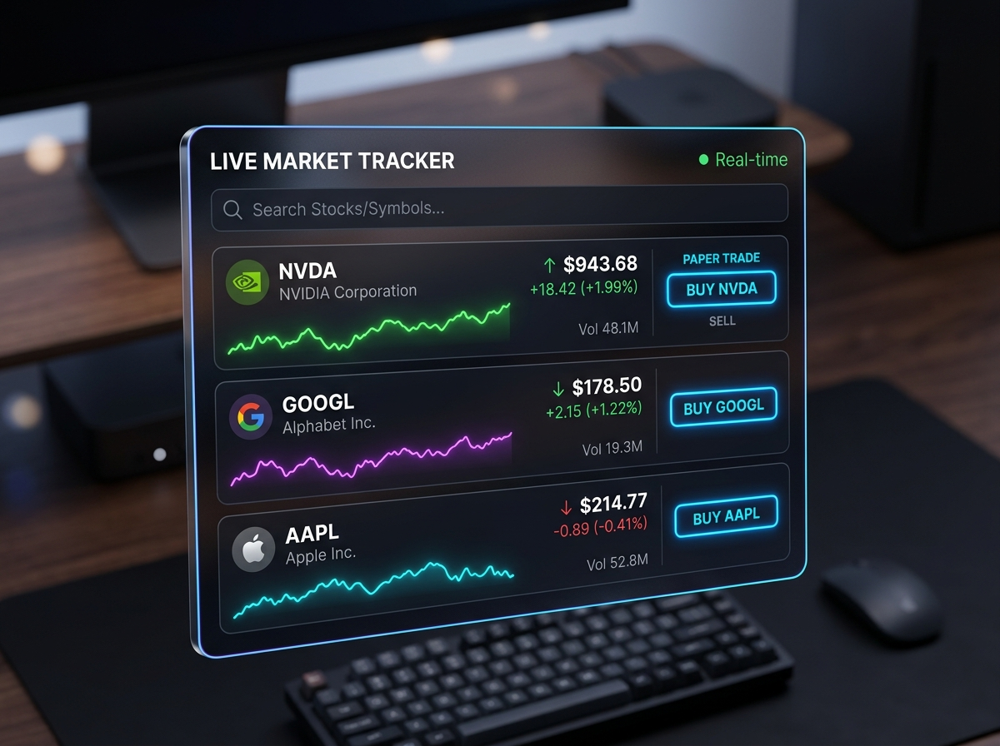
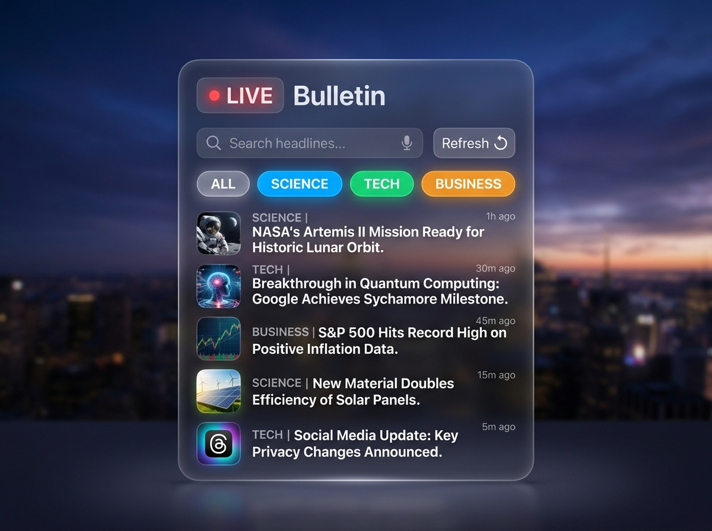

# 🌌 Google Chrome New Tab Dashboard

[](https://react.dev)
[](https://vitejs.dev)
[](https://tailwindcss.com)
[](https://expressjs.com)
[](https://ai.google.dev/)
[](https://opensource.org/licenses/MIT)

A stunning, highly customizable, and premium **Google Chrome New Tab Dashboard** designed to elevate your daily productivity. Packed with high-fidelity glassmorphic widgets, a dynamic customization engine, integrated Google Search (featuring Gemini AI Companion, simulated Google Lens image upload, and real-time Voice search), and a beautiful particle canvas layer.

---

## 📸 Visual Previews

### 🌌 Interactive Desktop Layout
Enjoy a fully interactive bento-grid workspace styled with beautiful glassmorphism, transparent blurred elements, custom wallpapers, and dynamic physics particle canvas trails.
<p align="center">
  
</p>

---

## 🚀 Key Features

### 1. 🛠️ Dynamic Customization & Theme Engine
Configure your workspace to fit your creative mood. Our dedicated glassmorphic controller allows you to:
- Slide through customizable glass backdrop blur settings.
- Adjust opacity, toggle soft neon glowing drop shadows, and personalize the system accent color.
- Select from high-resolution curate nature & space backdrops or upload your own local image.

### 2. 🦊 User Profile Sync & Google Account Manager
Seamlessly mock and sync with your **Google Chrome Account**.
- Displaying active synchronizer metrics with an active **"Sync Active"** badge.
- Includes a gorgeous customizable user profile panel detailing user account info (`waheedwar776@gmail.com`).
- Personalize with nostalgic Google Chrome retro preset avatars (Astronaut 👨‍🚀, Fox 🦊, Cat 🐱, Panda 🐼, Ninja 🥷, Dragon 🐲) or upload a custom image.

### 3. 📈 Stock Market Tracker Widget
Keep a close eye on your financial goals with a virtual stock exchange simulator.
- Real-time stock indices (NVDA, GOOGL, AAPL, MSFT, TSLA, AMD).
- Interactive **neon-colored sparkline charts** tracking recent percentage swings.
- Instant virtual paper trading system enabling rapid Buy/Sell commands and live portfolio balance updates.
<p align="center">
  
</p>

### 4. 📰 Live News Bulletin Widget
Stay connected with the outer world.
- Aggregates direct, real-time technology, engineering, and web development bulletin headlines from **Dev.to**.
- Filter articles instantly via category tags: Tech, Science, Business, and Career.
- Implements deep-dive overlay lightboxes and quick category searches.
<p align="center">
  
</p>

### 5. 🔍 Google-Powered Smart Search
An ultra-functional search bar mimicking real-world Google Chrome searches:
- **Gemini AI Companion**: Toggle the interactive AI sidepanel and chat live with an intelligent assistant proxy.
- **Simulated Google Lens**: Drag-and-drop or upload images into the search input to query through optical analysis simulations.
- **Voice Search**: Utilizes standard browser Web Speech API queries to transcribe vocal dictates directly into search text.

### 6. 🎨 Physics Magic Canvas
Behind the widgets lies an interactive particle-physics workspace. Hover over the empty canvas to witness responsive trailing effects, kinetic mouse collisions, and starry flow-fields that breathe life into static workspaces.

### 7. 📁 Additional Bento-Grid Widgets
- **Clock & Dynamic Weather Widget**: Displays active UTC clock, date metrics, and interactive multi-day forecast summaries.
- **Task & Checklist Planner**: High-fidelity checklist management with task statuses and percentage meters.
- **Telemetry Performance Widget**: Track mock system metrics like CPU load, network spikes, and memory allocations in real-time.

---

## 🛠️ Architecture & Tech Stack

Our workspace follows a state-of-the-art **Full-Stack (Vite + Express)** compilation pipeline.

```
├── server.ts                  # High-performance Express web proxy
├── src/
│   ├── main.tsx               # Client bootstrap entry point
│   ├── App.tsx                # Main workspace application controller
│   ├── types.ts               # Shared system type boundaries
│   ├── index.css              # Custom Tailwind directives & typography
│   ├── components/            # Modular Dashboard elements
│   │   ├── UserProfile.tsx        # Active Profile Sync manager
│   │   ├── StockMarketWidget.tsx  # Simulated paper exchange tracker
│   │   ├── NewsWidget.tsx         # Live Dev.to tech aggregator
│   │   ├── SearchBar.tsx          # Smart query with Lens & Voice support
│   │   ├── GoogleAppsLauncher.tsx # Google Chrome shortcuts board
│   │   └── ...                    # Auxiliary widgets
│   └── lib/                   # Database managers & canvas physics
└── package.json               # Package rules and build orchestrations
```

### 📦 Key Technologies
- **Client Side**: React 19, TypeScript, Tailwind CSS 4, Motion (Animations), Lucide-React.
- **Server Side**: Express 4, tsx (dev engine).
- **Compilation Engine**: Vite 6, esbuild 0.25 (CJS server bundle optimizer).

---

## ⚙️ Development & Quickstart

### Prerequisites
Make sure you have [Node.js](https://nodejs.org/) installed on your machine.

### 1. Install Dependencies
```bash
npm install
```

### 2. Spin Up the Development Server
This boots up our custom Express server coupled with Vite's development middleware on port `3000`.
```bash
npm run dev
```

### 3. Build for Production
This compiles the client app into static HTML/CSS/JS files inside the `/dist` directory, and bundles the Node server into a single optimized CJS bundle `dist/server.cjs` utilizing `esbuild`.
```bash
npm run build
```

### 4. Run Production Build
```bash
npm run start
```

---

## 📜 License

This project is licensed under the MIT License - see the [LICENSE](https://opensource.org/licenses/MIT) page for details.

*Crafted with 💖 for high productivity developers.*
